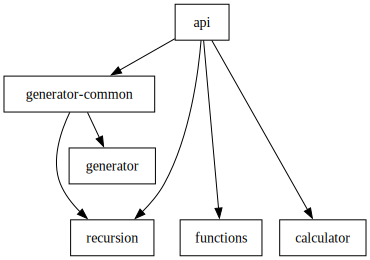

<div align="right"><p style='align: right;'>
Languages: <a href="README-RU.md"></a> <a href="README.md"></a> 
</p></div>

# ASTra

This is a toy parser generator. It parses LL-1 grammar and creates a Lexer and a Parser, written in Kotlin. It supports
both synthesized and inherited attributes.

The repository consists of several modules:



- `api` contains things that the generated parser uses.
- `generator` contains the generator itself. It's main method accepts two arguments:
  input file with grammar, and the output folder, that the lexer and parser should be written to.

- `samples:functions` is a grammar that parses Kotlin function headers:
    ```kt
    fun join(list : List<String>, sep : String) : String
    ```
  , except receivers hardly fit into LL-1, so for the simplification's sake they are allowed in parentheses only:
    ```kt
    fun <T> (T?).orElse(value : T) : T
    ``` 

- `samples:calculator` contains two calculators.
  One that allows basic operations with Doubles: `(1+2)*-sin(-3*(7-4)+2)` (functions are searched in `java.lang.Math`
  via reflection); and the one that operates [ordinal numbers](https://en.wikipedia.org/wiki/Ordinal_number)
- `sample:recursion` is a grammar that describes grammar. That is, while `generator` uses ANTLR4 to parse grammar,
  `recursion` uses `generator`. Or it could use itself.
  That's what `generator-common` is for, it includes classes that are shared between `recursion` sample and `generator`.

### Syntax

I guess you could just read [grammar.g](samples/recursion/src/grammar.g) for that, but here's quick introduction.
Each parser rule is a choice between sequences of terminals, non-terminals or code inserts. Each rule should end with
code insert:

```
addTerms [acc: T] : T
   := `+` term { val next = acc + term } addTerms(next) { addTerms }
    | `-` term { val next = acc - term } addTerms(next) { addTerms }
    | { acc } ;
```

Here `acc: T` is an inherited attribute, `: T` is synthesized one.
Results of each "subrule" are saved into variable with respective name. If there is only one of a kind, it's of the same
type, as a type of its synthesized attribute. If there are many, it's a list of those.

You can pass both single
identifiers and code inserts as inherited attributes:

```
maybeParams : List<Param>
    := `<` param moreParams({ mutableListOf(param) }) `>` { moreParams }
     | { listOf() }
     ;
```

Terminals are represented with either literals, enclosed in backticks, or regexes, enclosed in slashes. Whitespaces
inside regexes are not significant, if you want to use space literally, prepend it with backslash. Except for that,
regexes are as in Oniguruma library. For example, they allow recursion:

```
code = /\{(?:[^{}]+|\g<0>)*\}/;
```

### Tests

Each sample includes a few tests that use `Kotest` library. You can directly invoke those, gradle is configured to
automatically build `generator:shadowJar` and generate lexer and parser for each `.g` file in the source root. 